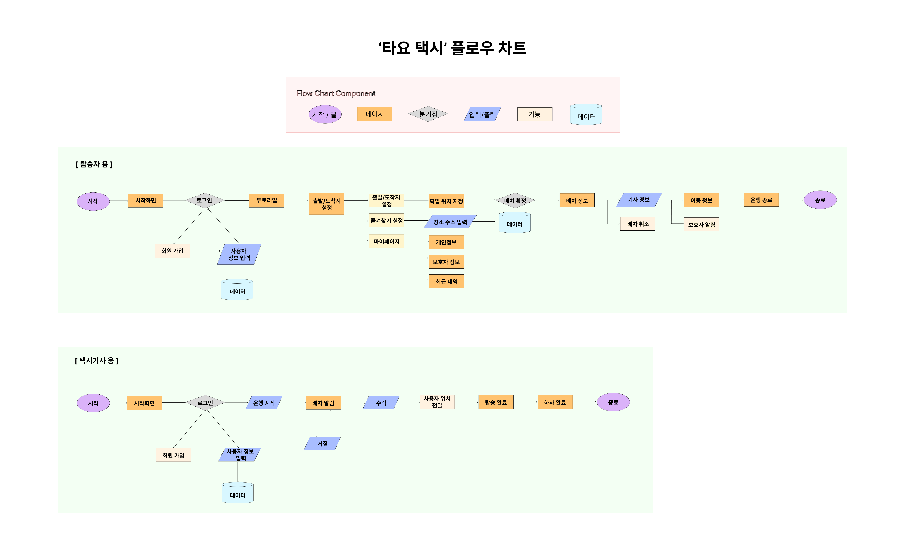

# 타요택시 (Tayo Taxi)

**타요택시**는 사용자의 현재 위치를 기준으로 목적지를 설정하고, 근처 택시를 호출할 수 있는 Flutter 기반 모바일 애플리케이션입니다. 사용자 친화적인 UI와 실시간 위치 연동 기능을 통해 누구나 쉽게 사용할 수 있도록 설계되었습니다.

기사 앱
https://github.com/cloudbread0714/tayo-taxi-driver

##  주요 기능

- 현재 위치 자동 추적 기능
- 현재 위치 기반 500m 이내 랜드마크 리스트 제공 후 픽업 위치 선정
- 즐겨찾기 기능 
- Firebase 연동을 통한 인증 및 실시간 데이터 처리

##  기술 스택

### 1) 프레임워크
- **Flutter (Dart)**: UI 구현 및 크로스 플랫폼 앱 개발

### 2) 백엔드 / 데이터베이스
- **Firebase Authentication**: 사용자 인증 처리
- **Cloud Firestore**: 실시간 데이터베이스 연동

### 3) 위치 / 지도 API
- **Google Maps API**
  - 승객 앱: 목적지 자동완성, 위도·경도 변환
  - 기사 앱: 목적지 지도 앱 연동
- **Tmap API**
  - 500m 이내 약국, 편의점, 주민센터, 학교 정문 등 픽업 위치 리스트 생성
- **Naver Map SDK**
  - 픽업 위치 지도 시각화
- **Geolocator 패키지**
  - 기사 및 승객의 현재 위치 조회

### 4) 디자인
- **Flutter 기본 위젯 활용**
  - 가독성을 고려한 글자 크기 설정 및 padding 확보

## 플로우 차트 

## 개발 팀원 

