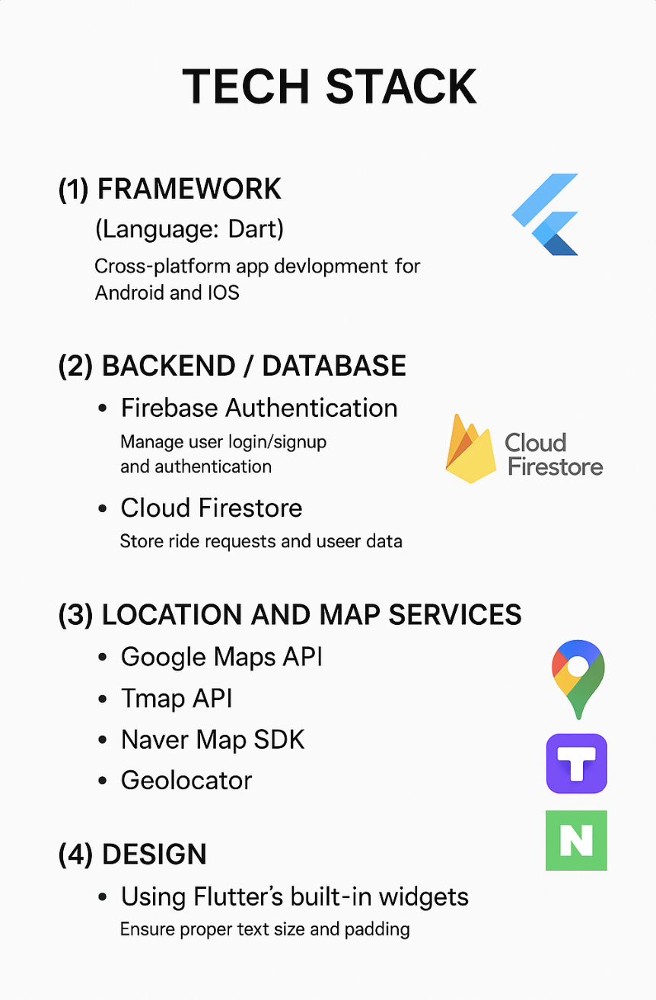

# 타요택시 (Tayo Taxi)

**타요택시**는 사용자의 현재 위치를 기준으로 목적지를 설정하고, 근처 택시를 호출할 수 있는 Flutter 기반 모바일 애플리케이션입니다. 사용자 친화적인 UI와 실시간 위치 연동 기능을 통해 누구나 쉽게 사용할 수 있도록 설계되었습니다.

## 🚖 주요 기능

- 현재 위치 자동 추적 기능
- 현재 위치 기반 500m 이내 랜드마크 리스트 제공 후 픽업 위치 선정
- 즐겨찾기 기능 
- Firebase 연동을 통한 인증 및 실시간 데이터 처리

## 🛠️ 기술 스택

## 플로우 차트 

## 팀원 

